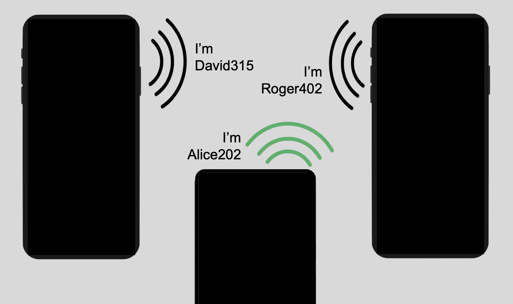

# Making iPhones Advertise in the Background

This is a reference app for Bluetooth advertising in the background with the Overflow Area to encode beacon major/minor.  When the app is in the foreground, it will also advertise iBeacon.
This technique allows backgrounded iPhones to advertise their identity to other iPhones in the vicinity.  When combined with other techniques, it allows all Android and iPhone devices in the vicinity to advertise their identity to eachother.



## How to run

1. Obtain an Apple Developer account
2. Install XCode 11.5 or newer
3. Plug in an iPhone with iOS 13.x or iOS 14 device to your Mac, and authorize it as a development device with XCode
4. Using XCode open this project OverflowAreaBeaconRef.xcodeproj
5. If needed, change the team and package of the project to match your Apple developer account.
6. Choose your phone as the destination and then choose Product -> Run from XCode
7. Accept all permission prompts coming from the app  

## Behavior

Upon startup the app will generate a random minor between 0 and 9999 to assign to itself. It will begin advertising this minor (as iBeacon in the foreground and as OverflowArea for when it is in the background.)  Each time you start the app it will get a new beacon minor.  So if using with a second app a new row will show up on the screen when you 
restart.

## Screen output


The screen will show a list of distinct beacon major/minor combinations seen since the app started up.
It will also show any error conditions with phone state or permissions (if known)
The beacon type will also be shown (iBeacon vs. OverflowArea).  Typically OverflowArea is seen as they come in much more frequently than iBeacon when the screen is on.

## Log output

```
2020-08-23 17:47:44.845180-0400 OverflowAreaBeaconRef[488:76358] I just read iBeacon advert with major: 1 minor: 1277
2020-08-23 17:47:44.909125-0400 OverflowAreaBeaconRef[488:76648] I just read overflow area advert with major: 1 minor: 1277
```
## API

The following API is implemented by the FusedBeaconManager class:

```
class FusedBeaconManager {
    func configure(iBeaconUuid: UUID, overflowMatchingByte: UInt8, major: UInt16, minor: UInt16, measuredPower: Int8)
    func startTx() -> Bool
    func stopTx() -> Bool
    func startScanning(delegate: OverflowDetectorDelegate) -> Bool
    func stopScanning()
}


protocol OverflowDetectorDelegate {
// type can be "iBeacon" or "OverflowArea". proximityUuid, and distance are only populated for iBeacon
    func didDetectBeacon(type: String, major: UInt16, minor: UInt16, rssi: Int, proximityUuid: UUID?, distance: Double?)
}
```


## Pitfalls

This technique works well on most devices under default conditions. But there are dozens of things that can stop it from working, and it is very easy to cause one to happen
especially on developer devices.  Below 


* Location turned off - No iBeacons will be detected, nothing will be detected in the background

* Location permission not granted - No iBeacons will be detected, nothing will be detected in the background

* "Always" Location permission not granted - Nothing will be detected in the background

* Blutetooth turned off - Nothing will be detected

* Bluetooth permission not granted - No OverflowArea beacons will be detected. No iBeacon will be transmitted:0

* Airplane mode - Nothing will be detected or transmitted

* Bluetooth stack crash - Nothing will be detected and/or transmitted depending on the nature of the crash

* iOS 14 Beta - Beta builds prevent rotation of advertising in the background. This app has rotation disabled for that reason.

* "Polluted Overflow Area" - If other apps are installed on the device that advertise a bluetooth service, it can pollute the overflow area and make the system unusable.  The reference app is set up to use a Hamming code to avoid this, but as few as two advertised backgrounds services can defeat this. 

* Custom notification settings - If notificaton setttings are set to disable screen on during notifications (e.g. do not disturb mode), overflow area adverts cannot be detected.

* Proximity Sensor - If the phone is face down on a desk, in a pocket or puse, or held up to your face, the proximity sensor will prevent the screen from going on keeping overflow area advertisements from being read.

* Apple Watch - If a phone is paired with an Apple Watch, by default, notifications will go to the watch.  This defeats screen on notifications. The user will need to change their Watch settings to send notification delivery to the phone thereby allowing screen on notifications.  This prevents reading overflow area advertisements.

* Emitting overflow advertisements in the foreground.  While the reference app is designed to emit iBeacon in the foreground and overflow in the background, it is easy to modify an app to accidentally send overflow area adverts in the foreground.  When this happens, the advertisement will be corrupted by one bit not being set.  This is caused by that bit going into a standard service UUID advertisement instead of the overflow area.  This bit is unpredictable.

### Changes for iOS 14

As of iOS 14, starting a new advertisement in the background is disallowed.  This means it is not possible to do either of the following:

1. Rotate the OverflowArea advertisement to avoid collisions.   A previous strategy of using interleaving to avoid collisions in the CollisionAvoider.swift can no longer be used.  A new startegy uses Hamming codes that can correct against one bit error and detect two bit errors.

2. Switch from iBeacon to Overflow Area when moving to the background.  As a result, we must leave Overflow Area adverts going in the foreground so that when the app shifts to the background, they will already be started.  iBeacon is also advertised in the foreground, but it will stop automatically when the app moves to the background.

This app has been updated with iOS 14 in mind, effecitvely applying the changes above to iOS 13 even though they are not expressedly needed for that platform.

### Status as of iOS 16

Tests on an iPhone 11 running iOS 16.0 on 2023/01/16 show this app and techique continues to work.
